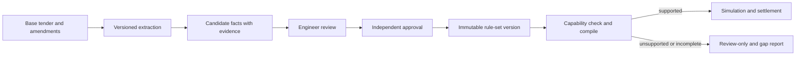

# Tender Families And Executable Rules

Status: proposed target design. Current support is described in the handoff index.

## 1. Capability Matrix

| Family | Delivery/compliance model to configure | Revenue model to configure | Current state | Planned release |
|---|---|---|---|---|
| NHPC-style FDRE | Daily selected peak schedule; monthly energy-based peak availability; annual CUF band | Eligible PPA energy, permitted merchant sales, tender-specific deductions | Existing implementation with NHPC defaults; audit required | E1 |
| SECI CfD-I supplied RfS | Selected exchange blocks totaling two hours/day; weekly shortfall accounting | Exchange revenue plus signed CfD settlement, fees, REC sharing and penalties | Extraction/review only | E2 |
| RTC renewable | Hour/block minimum supply and energy obligations from the actual tender | PPA with time-specific shortfall/deduction rules | Not implemented | E3 |
| Scheduled-profile FDRE | Buyer-provided demand time series and permitted deviations | Delivered/accepted energy and schedule-specific penalties | Not implemented | E3 |
| Energy-only solar/wind/hybrid | Annual/monthly energy, CUF, export restrictions as specified | Energy tariff and any permitted excess-energy treatment | Core assets reusable; tender adapter absent | E3 |
| Standalone storage/tolling | Contract power, usable energy, duration, availability, cycles, charging ownership | Capacity/availability and/or throughput charges | Asset dispatch reusable; settlement absent | E3 |

These are product families, not universal statements about every tender issued by
an agency. An issuer name must never select an adapter without rule validation.

## 2. Source Package And Review Lifecycle



Document states: uploaded, scanning, extracting, extracted, partial, failed,
superseded. Extraction success does not approve any fact.

Fact states: unreviewed, corrected, accepted, rejected, conflicted, superseded.
Rule-set states: draft, in_review, approved, superseded, withdrawn.
Capability states: supported, partially_supported, unsupported, unclassified.

For every extracted fact store the original text, candidate typed value, unit,
evidence page and bounding box when available, extractor version, and extraction
method. Preserve `missing`, `default_assumption` and `inferred` as distinct
provenance types. A fallback value cannot receive a high-confidence source label.

Approvals are per fact and per complete rule-set version. Approval of a phrase
does not certify that a solver has implemented the corresponding obligation.

## 3. Canonical Rule Structure

Each rule has the following minimum contract. The example JSON in `examples/`
is an illustrative review draft, not an engine configuration ready for execution.

| Field | Meaning |
|---|---|
| `rule_id`, `version` | Stable semantic identity and immutable version |
| `rule_type` | Registered type such as `energy_minimum`, `availability`, `cuf_band`, `settlement`, `penalty` |
| `scope` | Tender/project/site/technology and effective dates |
| `quantity`, `unit`, `basis` | MW, MWh, kWh/MW/day, ratio, INR/kWh; AC/DC, gross/net, PoI or generator terminals |
| `calendar` | Timezone, settlement step, contract-year boundary and contract-week definition |
| `aggregation` | Time block, day, contract week, month, contract year or full term |
| `schedule` | Fixed, buyer supplied, day-ahead selection, or registered scenario policy |
| `denominator` | Contract MW, eligible energy, scheduled energy, or approved obligation series |
| `tolerance` | Fraction vs percentage points, direction, rounding, grace/exclusions |
| `treatment` | Hard feasibility, priced shortfall, report only; mandatory rules cannot be relaxed silently |
| `dependencies` | Other rule IDs and input series needed to evaluate it |
| `evidence` | Document hash/version, physical page, printed page, clause, excerpt |
| `review` | Reviewer/approver identities, decisions, timestamps, reasons |
| `implementation` | Adapter version, capability state and validation-suite ID |

Use decimal/string money values in persisted commercial inputs; convert under
explicit calculation policies. Unknown values are null with a reason, never zero.
The typed schema rejects unknown rule types and incompatible units.

## 4. Rule Compiler Contract

Implement a registry of typed rules, not Python expressions stored in documents.
No `eval`, generated SQL or arbitrary executable scripts from extracted text.

```python
class TenderAdapter:
    def validate(self, rules, inputs): ...  # issues with paths, severity and evidence
    def compile(self, approved_rules, calendar): ...  # constraints + settlement plan
    def dispatch_requirements(self, compiled_rules, scenarios): ...
    def evaluate_compliance(self, dispatch, compiled_rules): ...
    def settle(self, accepted_energy, prices, compiled_rules): ...
```

Compilation returns a rule-by-rule capability report and a deterministic hash.
Dependencies must be available, units compatible and versions approved before
the optimizer accepts the compiled result. The same compiled version must drive
dispatch, finance, compliance dashboards and report exports.

New adapter registration requires specification, source-backed fixtures,
independent expected results, API/UI field mapping and a regression-suite version.
Unknown tender classifications remain review-only.

## 5. Scheduling And Calendar Semantics

- Fixed clock windows are half-open: `[08:00,10:00)` contains 08:00 and 09:00
  hourly intervals, not the interval starting at 10:00.
- Store time-series timestamps with timezone and interval duration; do not encode
  all contracts as fixed positional 8,760 arrays. Calendar and contract years differ.
- Make the CUF denominator convention explicit. The legacy 8,766-hour convention
  must not automatically control another tender or change simulated interval counts.
- Support leap years, partial commissioning years and contract anniversaries.
  Contract weeks require an approved anchor date and partial-week treatment.
- A two-hour morning block and a two-hour evening block do not imply four hours
  of uninterrupted storage. The actual intervening charging opportunity matters.
- Fifteen-minute delivery uses `energy_MWh = power_MW * 0.25`. Do not copy hourly
  energy into each quarter hour. Any resampling assumption is versioned and labelled.
- Capacity, charging and export constraints apply per interval, not just to totals.
- Availability may mean energy ratio, count of compliant intervals or physical
  uptime. The denominator and exclusions must come from the approved rule.

## 6. Supplied SECI CfD-I Reference Case

Use the supplied documents as acceptance fixtures. These observations are scoped
to those file versions and require commercial review before executable release.

| Document | SHA-256 | Relevant physical PDF pages |
|---|---|---|
| `Revised_RfS_for_1000_MWh_assured_Peak_Supply_under_CfD_Mechanism_(CfD-I).pdf` | `8f56020a6b138d1b421aa9e5896e7dae0a0abd24b99ef8d444f610314f2fd10c` | 1, 10, 14, 17, 21-25, 38 |
| `Amendment-01-SECI-CfD-I-final_upload.pdf` | `2c9acd3f1ca83cad76dc65dc2a1e3d465445a72cddbda21804a60b51bc4f0ce8` | 1-2 |

The PDFs currently reside outside the Git repository. Store them in the fixture
asset store with access control, or have an authorized maintainer supply them.
Physical PDF page 25 is printed page 24 in the revised RfS.

| Condition | Observed source meaning | Implementation implication |
|---|---|---|
| Quantum | 1,000 MWh, expressed as 500 MW x 2 hours | Tender total is distinct from the individual fixed bid MW |
| Term | 12 years from SCD, with stated extension/early-operation provisions | Do not inherit the NHPC 25-year PPA |
| Storage | With or without ESS | No unconditional mandatory-BESS flag |
| Daily delivery | 2,000 kWh per contracted MW during selected peak hours | Daily eligible-energy cap and obligation |
| Selection | Two hours within 18:00-24:00, subject to non-solar definition; time blocks need not be consecutive | Day-ahead block selection, not morning/evening FDRE windows |
| Weekly shortfall | 14 MWh/MW per contract week; shortfall beyond 10% attracts the stated penalty | Weekly compliance, monthly collection; approved curtailment adjustment |
| External green | Up to 25% of total annual required energy; storage contribution measured on discharge | Annual provenance ledger; no automatic use of legacy 5% limit |
| Settlement | Time-block MCP versus strike price with graded Pool:RPD sharing | Separate market revenue and signed settlement cash flows |
| Amendment | Pool replenishment and 50:50 sharing on MCP portion above INR 10/kWh | Explicit amendment versions and affected clauses, not replace-all text |

Example from the amendment, for one kWh: SP=5.7 and MCP=12.0 gives total gain
6.3. The gain up to MCP=10 is 4.3 and uses the stated slab-3 30:70 Pool:RPD
ratio; the 2.0 increment above 10 uses 50:50. Pool receives 2.29, RPD retains
gain 4.01, and RPD revenue before other charges is 12.0 - 2.29 = 9.71.
Do not count SP again as additional revenue on top of the exchange receipt.

CfD search cannot simply reuse PPA tariff bisection: strike-price changes may
change slab membership, incentives and optimal schedule. Prove monotonicity for
any bracket solver used, or search and validate the breakpoints explicitly.
The model needs market-price/clearing scenarios, fees, eligible volumes and
approved interpretation of the weekly and curtailment rules before it can price a bid.

## 7. Amendments And Authority

An amendment belongs to a tender package and identifies affected document type
(RfS, agreement, annexure), clause and action (add, replace, delete, clarify).
Publication date alone is insufficient to resolve an ambiguous conflict.
Record effective date, priority rationale, authority and reviewer decisions.

Show base text, amendment text and proposed consolidated rule side by side.
Ambiguous matches remain conflicts; no silent merge. Base facts remain immutable.
Approval creates a new rule-set version and marks dependent runs stale. Existing
runs and reports remain readable with the historical version they used.

## 8. Extraction Reliability

Record parser engine, model/configuration version, duration, pages attempted,
pages extracted, OCR use, warnings and fallback path. Store native PDF text
alongside reconstructed tables when available. Preserve table row/column and
multi-page continuation provenance.

Observed prototype test: the two-page amendment converted with Docling but
reported dropped table cells; the 129-page RfS exceeded the 180-second timeout
and fell back to standard extraction. These are regression cases, not a claim
that every field was verified. Add page-batch processing and resume/retry jobs.

Model downloads should be prepared in worker images or a controlled model cache.
Changing extraction engine creates a new extraction version; previously accepted
facts are not overwritten. Document text may contain instructions; do not execute
them or allow them to change the extraction/review policy.
