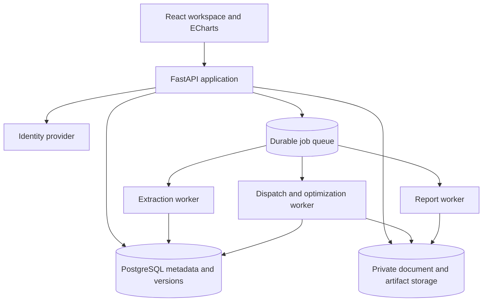

# Architecture, Data And API Contracts

All `/api/v1` routes and persistent entities below are proposed. They do not yet
exist in the prototype. Prefer a modular backend with separately deployed workers
before adding independently managed microservices.

## 1. Target Topology



Retain React, Vite, FastAPI, Python and ECharts. Introduce TypeScript incrementally
as screens move into feature modules. Proposed persistence is PostgreSQL plus
private S3-compatible object storage. Use an existing organization-supported
durable job runner if available; otherwise select one in ADR-03 after measuring
long-job cancellation and worker-crash recovery. Do not use in-request background
tasks as the only durable scheduler.

Separate the extraction runtime (Docling/model weights) from numerical workers
so dependency upgrades cannot silently change approved financial results.
Pin Python, JS and numerical dependencies in release images and record image IDs.

## 2. Module Boundaries

```text
frontend/src/
  app/                 routes, shell, identity, project context
  components/          tables, inputs, charts, evidence, status, forms
  features/            tenders, review, projects, yield, finance, runs, reports
  api/                 generated types and typed client
backend/
  api/v1/              transport, authorization, validation
  domain/              entities, versions, states, units, invariants
  application/         use cases and transaction boundaries
  adapters/tenders/    legacy_nhpc, seci_cfd, future families
  adapters/storage/    metadata, blobs and series
  workers/             extraction, simulation, search, reporting
engine/
  assets/              solar, wind, BESS, grid
  dispatch/            interval balance and scheduling
  compliance/          aggregation and shortfall accounting
  settlement/          PPA, CfD and future commercial adapters
  finance/             statements, debt, tax, bid-price solving
```

This is a target layout. First wrap the root engine files in adapters and keep
legacy imports working; move files only after parity tests cover their callers.

## 3. Persistent Entities

Every owned record carries `tenant_id`, ID, creation identity/time and a version
or revision. Tenant-scoped foreign keys prevent cross-tenant associations.

| Entity | Required content | Version/relationship rule |
|---|---|---|
| Organization, membership | User, role, project access | Membership checked on every request |
| Tender package | Issuer, tender ID, family candidate, owner | One package has many document versions |
| Document version | Blob key, SHA-256, MIME, pages, role, parent, issue/effective dates | Original immutable; duplicate hash may reuse bytes within tenant |
| Extraction version | Document version, parser/config/model, page status, output assets | New execution creates new version |
| Extracted fact | Raw/typed values, units, evidence, origin type | Original immutable; review corrections are separate |
| Review decision | Fact/version, corrected value, reason, reviewer, timestamp | Append-only event plus materialized current state |
| Amendment operation | Source/target clause, action, effective date, conflict state | References exact document versions |
| Rule-set version | Consolidated rules, compiler compatibility, approvals | Immutable after approval |
| Project version | Tender rule version, fixed bid MW, sites, grid, bounds, calendar | Editing creates draft successor |
| Resource profile | Site, technology, time index, P-level, basis, losses, provenance | Content hash and quality report |
| Financial assumption set | Costs, finance, tax, working capital, market inputs | One baseline and versioned scenario overrides |
| Run manifest | Input/version hashes, engine/solver version, mode, seed, tolerances | Immutable snapshot at submission |
| Job | State, attempt, lease, progress, failure, run ID | Retry does not duplicate logical run |
| Dispatch/settlement result | Series location, schema, row count, checksums | Never edit result series in place |
| Finance scenario | Parent run, frozen sizing/dispatch references, overridden financial inputs | Cannot mutate parent optimization |
| Report artifact | Template version, source run, status, reviewer, object hash | Published artifact immutable |
| Audit event | Actor, action, resource, old/new version references, reason | Server-generated; no secret or full-document log payloads |

Use relational records for business entities and approval state. Large time series
belong in partitioned columnar artifacts with compact SQL metadata, not millions
of individual JSON fields in the project row. Use UTC timestamps plus explicit
market timezone; preserve original timestamp conventions during ingestion.

## 4. Input And Result Contract

Run input includes fixed contracted MW, approved rule-set version, site/profile
versions, technology bounds, financial-assumption version, scheduling/market
scenario versions, simulation calendar and engine options. Validate disabled
technologies, contradictory bounds and fixed-duration constraints before queueing.

Every field returned to the UI must use a documented unit. Never overload one
number as both a percentage and a ratio. Required examples:

| Quantity | Canonical unit | Display |
|---|---|---|
| Capacity | MW AC, MW DC explicitly distinguished | MW AC / MW DC |
| Storage | MW at named boundary, MWh nameplate/usable distinguished | Both values with basis |
| Energy | MWh per interval | MWh or GWh with labelled conversion |
| Tariff/strike/MCP | INR/kWh | Rs/kWh |
| Money | INR, exact decimal where appropriate | INR crore = INR / 10,000,000 |
| Fractions | Dimensionless ratio | Percent after multiplying by 100 |
| Time step | Minutes plus interval-start timestamp | Local time with timezone |

Result manifest fields: `run_id`, `run_status`, `feasibility_status`,
`financial_status`, `quality_level`, `objective`, `objective_value`,
`optimality_status`, `solver_status`, `best_bound`, `gap`, `simulated_years`,
`interpolated_years`, `warnings`, `artifact_refs`, `input_hash` and `stale_reason`.
Null tariff is accompanied by a reason; never serialize NaN as a JSON number.

## 5. API Map

| Area | Proposed endpoints | Required behavior |
|---|---|---|
| Identity | `GET /api/v1/me` | Server-derived tenant and project roles |
| Projects | `GET/POST /api/v1/projects`; `GET/PATCH /projects/{id}/draft` | Cursor pagination and optimistic concurrency |
| Versions | `POST /projects/{id}/versions`; `GET /project-versions/{id}` | Immutable run-ready snapshots |
| Uploads | `POST /uploads`; `POST /uploads/{id}/complete` | Scoped signed upload; verify size, MIME and checksum |
| Documents | `POST /tender-packages/{id}/documents`; `GET /documents/{id}` | Associate authorized asset and role |
| Extraction | `POST /documents/{id}/extractions` | 202 job, engine preference and configuration |
| Evidence | `GET /extractions/{id}/pages/{page}`; `GET /facts` | Structured evidence, warnings and pagination |
| Review | `POST /facts/{id}/decisions`; `GET /review-queues` | Authenticated identity, revision guard, reason |
| Amendments | `POST /tender-packages/{id}/amendment-operations` | Conflict-aware preview; no implicit publish |
| Rules | `POST /rule-sets`; `POST /rule-sets/{id}/validate`; `POST /rule-sets/{id}/approve` | Capability report before approval |
| Profiles | `POST /profiles`; `GET /profiles/{id}/quality` | Units, resolution, checksum and P-level provenance |
| Finance | `POST /financial-assumption-sets`; `GET /financial-assumption-sets/{id}` | Versioned typed assumptions |
| Runs | `POST /runs`; `GET /runs/{id}` | Immutable input snapshot and 202 job |
| Job lifecycle | `GET /jobs/{id}`; `POST /jobs/{id}/cancel`; `GET /jobs/{id}/events` | Polling baseline; resumable SSE optional |
| Results | `GET /runs/{id}/summary`; `/compliance`; `/series` | Series projection, time range and downsampling |
| Sensitivity | `POST /runs/{id}/finance-scenarios` | Frozen parent sizing and dispatch hashes |
| Reports | `POST /runs/{id}/reports`; `GET /artifacts/{id}/download` | Permission checks and expiring download links |

Routes without a prefix in the table inherit `/api/v1`. Existing `/api/*`
prototype routes remain behind a compatibility layer during migration, not
silently redefined with incompatible payloads.

Illustrative submission:

```json
{
  "project_version_id": "pv_001",
  "rule_set_version_id": "rv_003",
  "kind": "optimize",
  "objective": "minimum_required_ppa_tariff",
  "contracted_capacity_mw": 200,
  "financial_assumptions_version_id": "fv_007",
  "profile_version_ids": ["solar_a_p90", "wind_a_p90"],
  "simulation": {"mode": "full_contract", "calendar_version_id": "cal_01"},
  "engine_options": {"seed": 42, "time_limit_seconds": 1800}
}
```

`POST /runs` requires `Idempotency-Key`; success returns HTTP 202 with `run_id`,
`job_id`, `state=queued`, `input_hash`, `status_url`. Reusing a key with different
content returns 409. Conflicting draft revision returns 409; unsupported rules
return 422 with `rule_id`, input path and remediation. Unauthorized resources
must not leak existence through errors or signed links.

Decision request contains `expected_revision`, `decision`, `corrected_value`,
`unit`, `reason`, `evidence_refs`. Ignore client-supplied reviewer identity and
timestamps; derive them server-side. Support `If-Match` on draft writes.

## 6. Jobs And Run Consistency

Job lifecycle: queued -> running -> succeeded / failed / cancelled.
Running may enter cancel_requested; a worker acknowledges cancellation and
stops within a documented checkpoint bound. Progress reports phase and work
units, not invented percent-complete estimates.

Use worker leases/heartbeats, bounded retries and idempotent artifact writes.
Worker failure marks an attempt failed; it must not publish half-written results.
Upload artifacts under temporary keys, validate checksums, then atomically attach
the completed manifest. Jobs remain queryable after browser disconnect.

Run states distinguish completed feasible, completed infeasible, time-limited
incumbent, unsupported and numerical failure. A time limit is not infeasibility.
An infeasible fixed-size dispatch still returns best-achievable delivery and
shortfalls when that diagnostic mode is requested.

## 7. Finance Scenario Isolation

A finance-only scenario references one immutable optimized run. It can change
finance assumptions and either keep the bid price fixed or explicitly solve a
new required price. These are different UI modes and different result labels.
Neither mode can resize assets, reschedule dispatch, or change yield profiles.

Physical changes (SoH, RTE, augmentation quantity, grid losses, price-driven
dispatch policy) require a new operating run. A pure change to the price paid
for an already fixed augmentation schedule can remain a finance-only override.

When optimization completes again, create a new baseline. Archive previous
scenario comparisons; show the new baseline with cleared active overrides.
Do not erase history. Reject late responses whose parent run is no longer active.

## 8. Access And Operations

Roles: organization admin, project owner, engineer, financial analyst, reviewer,
approver and read-only client. Permissions are resource-scoped, not only tab-scoped.
Default production approval requires a different approver from the fact editor;
any administrator exception is explicit and audited.

Apply tenant checks to database queries, queues, object keys, retrieval indexes
and report links. PostgreSQL row-level policies can provide defense in depth;
test the actual service-role behavior rather than assuming policies cover owners.
Use organization SSO when available, short-lived sessions and managed secrets.

Record request/job IDs, versions, duration, solver termination, page coverage,
queue age and error categories. Avoid logging full tender text or credentials.
Back up metadata and object manifests together; test restore and reconciliation.
Health checks distinguish API readiness, worker availability and model-cache status.

## 9. Initial Nonfunctional Targets

These are proposed acceptance budgets, not measured promises. Benchmark on a
published reference machine and record profile/run sizes with results.

- Cached metadata page p95 < 1 second at 20 active users.
- A validated job submission acknowledges within 2 seconds, excluding upload.
- 129-page documents process asynchronously with page coverage and cancellation.
- Initial chart payload <= 2,000 plotted points per series; full data downloadable.
- No browser hydration of 25 years of interval rows; paginate/downsample on server.
- Persisted results survive worker and browser restarts; restore drill required.
- Set numerical tolerances per quantity and publish them with validation results.
- Worker quotas and resource limits prevent one organization exhausting capacity.

## 10. Engineering References

- [HiGHS](https://highs.dev/): LP/MIP/QP capability does not by itself certify a
  nonlinear financial capacity-search objective.
- [Docling pipeline options](https://docling-project.github.io/docling/reference/pipeline_options/): timeout and partial-result behavior informs extraction jobs.
- [PostgreSQL row security](https://www.postgresql.org/docs/current/ddl-rowsecurity.html): use as an additional tenant-isolation control.

Pin and test actual selected versions during implementation; these links are not
a substitute for a dependency lock or an architecture decision record.
